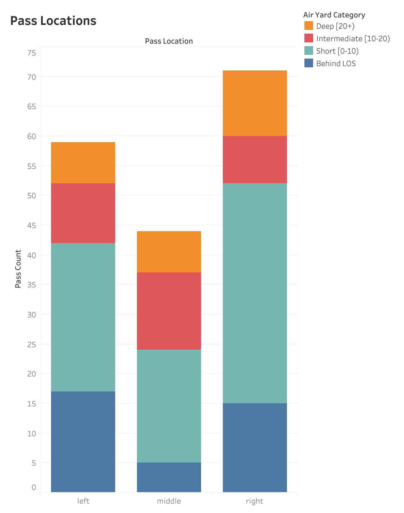
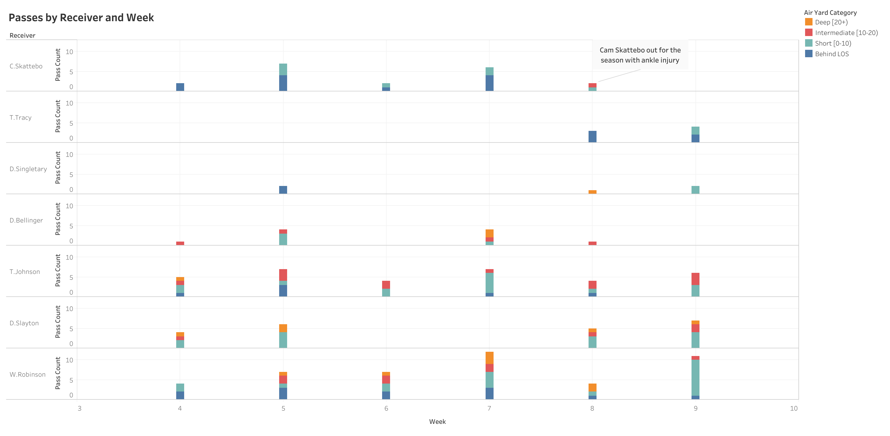

# New York Giants Passing Report (2025 Season)
Key Question: What is the New York Giants passing offense composed of? How (if at all) does it reflect the growth of rookie quarterback Jaxson Dart? Has it changed significantly throughout the season, and if so why?

## Tools Used and Methods
To complete this project, I utilized a Python script (seen in this repository) and made use of the nflreadpy Python libary. From this library I obtained play-by-play data from all the games in the 2025 NFL season. I also used the Pandas libary to filter the data to only the NY Giants offensive plays, to only their pass plays of the season, and finally to only the pass plays by rookie quarterback Jaxson Dart. After searching through the data I discovered there were some anomalies with two-point conversion plays and thus filtered them out.

I then produced many relevant summary metrics for Dart's passing performance, including computing a proxy value for play action passes, a passing completion percentage, as well as sorting each pass into bins based on the location to which Dart threw (left, middle, or right) and based on how far the pass traveled in the air. I also computed the number of passes thrown in each week, which will be used for later visualizations. I cleaned the data and exported it as a CSV to Tableau, where I created the following visualizations. I also created similar visualizations using the matplotlib library.

## Figure 1: Passes by Location and Air Yards

To explore the data and see the number of passes in each category, please see the interactive dashboard published on Tableau Public: [Tableau Public](https://public.tableau.com/views/JDartPassAnalysis/Dashboard3?:language=en-US&publish=yes&:sid=&:display_count=n&:origin=viz_share_link)

This chart illustrates Dart's pass targets. The passes are separated into throws to the left, the middle, and the right, and each column is colored according to the length of the pass. This figure shows a clear preference for the right side of the field and for passes behind the line of scrimmage and short passes (0-10 yards). The right side is where the most short passes occur, but is also the location where the most deep passes occur (11 deep passes as compared to 7 in each of the other two locations).

The large amount of passes behind the line of scrimmage and short passes may indicate a "West Coast" or quick-rhythm style offense relying heavily on high percentage passes. Throws to the left side of the field are often behind the line of scrimmage, and the highest percentage of behind the line of scrimmage passes are found here. This indicates a possible preference for screen passes or check downs to running backs in the flat on the left. The middle of the field is used primarily for short and intermediate length passes, suggesting passes to tight ends, slants, and dig routes.

## Figure 2: Pass Distances Over Time

To explore the data and see the opponent, number of throws in each category, and more, please see the interactive dashboard published on Tableau Public: [Tableau Public](https://public.tableau.com/views/JDartPassAnalysis/Dashboard1?:language=en-US&publish=yes&:sid=&:redirect=auth&:display_count=n&:origin=viz_share_link)

This graph separates Dart's total passes into each game and depicts the throws of each pass length as a percentage of the total passes for that week (therefore, summing the percentages of all four pass lengths for each week will result in 100%). This shows his overall tendencies and prevents games with large sample sizes from dominating smaller sample sizes. Dart was named the starting quarterback for the Giants in Week 4, where he started his professional career with 45% short passes, 25% passes behind the line of scrimmage, 20% intermediate passes, and 10% deep passes. This reliance on shorter passes would continue into the next week with an increased focus on passes behind the line of scrimmage and short passes, which would compose over 69% of his total passes for the week. This could perhaps indicate a Giants gameplan focused on making their rookie quarterback comfortable by emphasizing shorter, high-percentage throws.

From Weeks 6 - 8, passes behind the line of scrimmage see a significant decline in favor of deep and intermediate passes. While the short pass tendency peaks in Week 6, short passes also decline from weeks 7 - 8 until they reach their minimum in week 8. This could be indicative of the coaches slowly opening up the offensive playbook as Dart got more and more comfortable, and was more willing to test defensive intermediate and deep coverage.

Week 8 signified a turning point in the Giants offensive scheme. Cameron Skattebo, a fourth round pick by the Giants in the 2025 NFL Draft, had been a pivotal piece of the offense up until this point. He had been a threatening receiving back and forced the defense to adapt to his check-down and short yardage potential. By being such a threat on the line of scrimmage, Skattebo forced linebackers to respect the screen pass possibility and thus stay shallow in coverage or play flat-footed. This gave receivers more time and space to get open for intermediate and deep passes, as was indicated by the increased amount of intermediate and deep passes in Weeks 6 - 8.

In the second quarter of the Giants' Week 8 game against the Eagles, Cam Skattebo was injured and was ruled out for the season. This radically changed the New York offense, as it no longer had the presence of Skattebo to force the defense to commit to the line of scrimmage. This can be seen in the data for Week 9 against San Francisco, where every pass distance category dropped radically in usage except short passes. Dart no longer had the trusted back of Skattebo to pass to behind the line of scrimmage for screen plays or checkdowns and was similarly unable to find open receivers in the backfield, as the defense could safely ignore the line of scrimmage in favor of pass coverage. Prior to Week 9, the Giants had an average of 205.8 passing yards per game. In Week 9, this dropped almost 20 yards to 191 yards on 24 receptions out of 33 attempts (average of 8 yards per reception). This reinforces the above concepts and shows how the defense was able to lock down the backfield.

## Figure 3: Pass Distances by Receiver

To explore the data and see pass amounts and opponents, please see the interactive dashboard published on Tableau Public: [Tableau Public](https://public.tableau.com/views/JDartPassAnalysis/Dashboard2?:language=en-US&publish=yes&:sid=&:redirect=auth&:display_count=n&:origin=viz_share_link)

This graph shows the receptions by some of the notable receivers, tight ends, and running backs on the New York Giants for the 2025 season. C. Skattebo, T. Tracy, and D. Singletary are running backs, D. Bellinger and T. Johnson are tight ends, and D. Slayton and W. Robinson are wide receivers. From weeks 4 - 8, Cam Skattebo handles the vast majority of the total passes behind the line of scrimmage (e.g. screens, check-downs). After he was sidelined with his season-ending ankle injury in Week 8, these behind line of scrimmage passes were largely abandoned. The other running backs (T. Tracy and D. Singletary) took Skattebo's place but did not have the same success with these consistent high percentage passes. This reinforces the ideas seen in Figure 2, wherein the defense was able to put more focus on pass coverage without having to worry about the line of scrimmage as much. This prevented intermediate and deep receptions from key players who typically focused on such passes, such as D. Bellinger and W. Robinson. They had to modify their play style to instead create shorter, higher-percentage pass options.

# Conclusions
The above observations are the symptoms of a now one-dimensional offense. While J. Dart has the capability and prowess to test elite defenses far downfield, the offense is not threatening enough on the line of scrimmage to enable such passes to be made. With Skattebo out for the remainder of the season, there is no sign that the situation will improve for the Giants. The team is clearly focusing on creating short and high-percentage receptions, but this plays directly into the hand of the defense and is a bad omen for the rest of the season.
